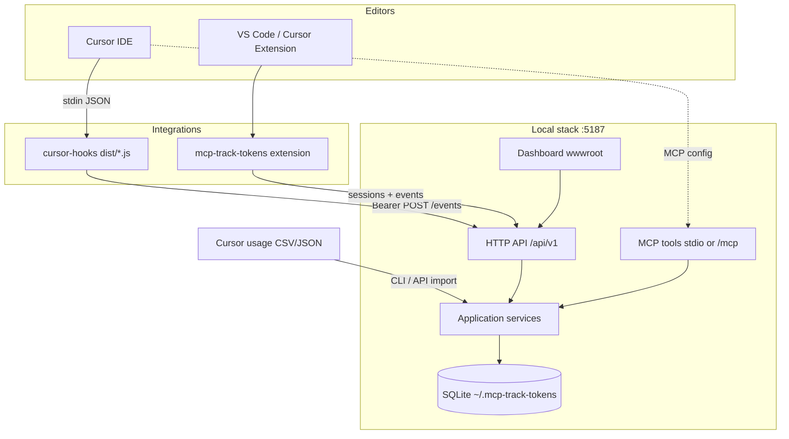
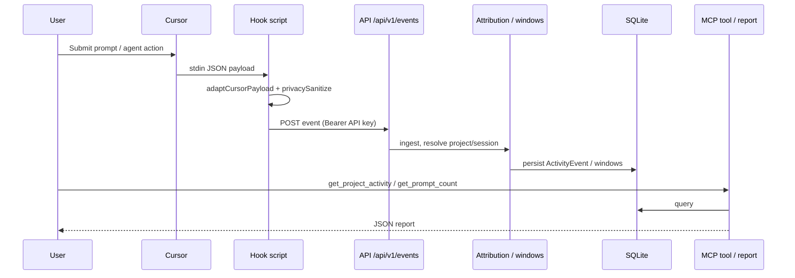
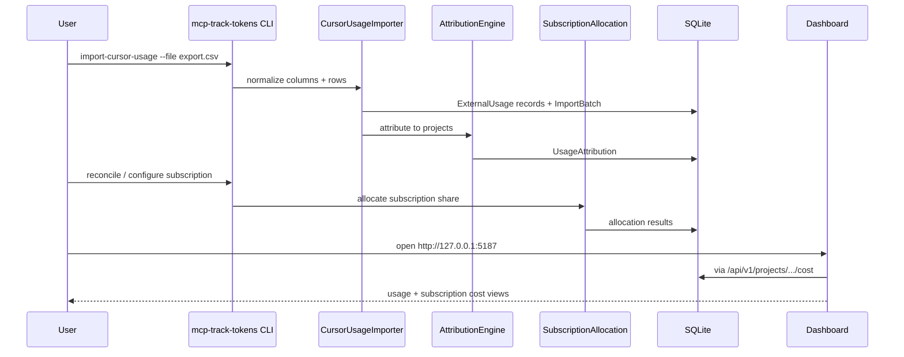

# MCP Track Tokens

Local-first activity and cost tracking for AI-assisted development in **Cursor** and **VS Code**.  
Version **1.0.0** · Default server `http://127.0.0.1:5187` · Database `~/.mcp-track-tokens/mcp-track-tokens.db`

MCP Track Tokens correlates **editor activity** (prompts, agents, sessions) with **imported Cursor usage exports** so you can attribute time and cost to projects — without claiming to passively intercept every model call inside the editor.

| Surface | Path |
| --- | --- |
| Solution | `McpTrackTokens.sln` |
| CLI / Server host | `src/McpTrackTokens.Cli` (assembly `mcp-track-tokens`) |
| HTTP + MCP server | `src/McpTrackTokens.Server` |
| Dashboard | `src/McpTrackTokens.Dashboard` |
| VS Code extension | `extensions/mcp-track-tokens-vscode` |
| Cursor hooks | `integrations/cursor-hooks` |
| Docs | [`docs/`](docs/) |
| Install scripts | [`scripts/`](scripts/) |
| Windows MSI | [`docs/windows-msi.md`](docs/windows-msi.md) · `artifacts/installer/MCP-Track-Tokens-Setup.msi` |

---

## Table of contents

1. [Product overview](#1-product-overview)
2. [What can and cannot be tracked](#2-what-can-and-cannot-be-tracked)
3. [Architecture](#3-architecture)
4. [Privacy model](#4-privacy-model)
5. [Prerequisites](#5-prerequisites)
6. [Building](#6-building)
7. [Windows MSI (recommended)](#7-windows-msi-recommended)
8. [Running the server](#8-running-the-server)
9. [Installing the dashboard](#9-installing-the-dashboard)
10. [Installing the VS Code extension](#10-installing-the-vs-code-extension)
11. [Installing Cursor hooks](#11-installing-cursor-hooks)
12. [Configuring Cursor MCP](#12-configuring-cursor-mcp)
13. [Registering a project](#13-registering-a-project)
14. [Importing Cursor usage](#14-importing-cursor-usage)
15. [Cost attribution](#15-cost-attribution)
16. [Subscription allocation](#16-subscription-allocation)
17. [MCP tools](#17-mcp-tools)
18. [Reports](#18-reports)
19. [Backup and restore](#19-backup-and-restore)
20. [Security](#20-security)
21. [Troubleshooting](#21-troubleshooting)
22. [Known limitations](#22-known-limitations)

---

## 1. Product overview

MCP Track Tokens is a **local tracking stack** that helps developers and teams answer:

- Which projects received AI-assisted work?
- How many prompts / agent runs / active minutes occurred?
- How do imported Cursor usage costs map onto those projects?
- How should a flat Cursor subscription be allocated across projects?

It provides:

1. A **.NET 8 server** exposing REST (`/api/v1/*`), health checks, static dashboard files, and MCP tools (stdio or optional HTTP `/mcp`).
2. A **CLI** for serve/migrate/import/export/reconcile/API keys/hooks install.
3. **Cursor hooks** that POST privacy-sanitized activity events.
4. A **VS Code / Cursor extension** with session commands and `@track` for guaranteed prompt observability in chat.
5. A **React dashboard** for browsing projects, unallocated items, imports, and costs.

Data stays on your machine by default (SQLite under `~/.mcp-track-tokens/`).

---

## 2. What can and cannot be tracked

### Can be tracked

| Signal | Source |
| --- | --- |
| Prompt submitted / agent lifecycle / session start & end | Cursor hooks → `POST /api/v1/events` |
| Prompt activity via `@track` | VS Code extension chat participant |
| Sessions, heartbeats, inactivity windows | Extension + API `/api/v1/sessions/*` |
| Repository path / remote URL context | Hooks git resolve + extension |
| Imported token counts and usage cost | Cursor CSV/JSON exports |
| Manual allocation of activity or usage | MCP tools / dashboard / CLI reconcile |

### Cannot be tracked (by design / platform limits)

| Limitation | Reality |
| --- | --- |
| Passive interception of all Cursor/VS Code prompts | MCP servers do **not** see every chat turn automatically |
| Automatic internal Cursor token meters | Token/cost numbers come from **exports you import**, not live meter scraping |
| Guaranteed coverage without hooks or `@track` | Install hooks (Cursor) and/or use `@track` (VS Code) |
| Prompt/response bodies by default | Content is **not** stored unless you explicitly enable and configure encryption |
| Single unified “truth” dataset | Activity and usage are **separate datasets** correlated by attribution rules |

See [§22 Known limitations](#22-known-limitations).

---

## 3. Architecture



### Sequence: Cursor prompt → report



### Sequence: CSV import → dashboard



More detail: [`docs/architecture.md`](docs/architecture.md).

---

## 4. Privacy model

Defaults favor **metadata over content**:

| Setting | Default | Meaning |
| --- | --- | --- |
| `StorePromptContent` | `false` | Raw prompts are not persisted |
| `StoreResponseContent` | `false` | Model responses are not persisted |
| `EnablePromptHashing` | `true` (server) | Optional SHA-256 hash for correlation |
| Hooks `MCP_TRACK_TOKENS_STORE_PROMPT_CONTENT` | unset/`false` | Hooks send length (and hash only if enabled) |

When content storage is enabled, the server only keeps ciphertext if encryption is configured (`EncryptionKeyPath`). Hooks never place raw prompt text into event `metadata`.

Details: [`docs/privacy.md`](docs/privacy.md).

---

## 5. Prerequisites

| Requirement | Notes |
| --- | --- |
| [.NET SDK 8](https://dotnet.microsoft.com/download/dotnet/8.0) | `global.json` pins `8.0.100` with `rollForward: latestMajor` |
| [Node.js 20+](https://nodejs.org/) | Dashboard, extension, and hooks builds |
| Cursor and/or VS Code 1.85+ | For hooks / extension |
| Optional: Docker | `Dockerfile` + `docker-compose.yml` |

---

## 6. Building

### One-shot scripts

```powershell
# Windows
.\scripts\build-all.ps1

# Optional: also pack the VSIX
.\scripts\build-all.ps1 -PackExtension
```

```bash
# Linux / macOS
chmod +x scripts/build-all.sh scripts/install-linux.sh
./scripts/build-all.sh
```

### Manual

```powershell
dotnet build McpTrackTokens.sln -c Release
dotnet test McpTrackTokens.sln -c Release

npm --prefix src/McpTrackTokens.Dashboard ci
npm --prefix src/McpTrackTokens.Dashboard run build
Remove-Item -Recurse -Force src/McpTrackTokens.Server/wwwroot -ErrorAction SilentlyContinue
Copy-Item -Recurse src/McpTrackTokens.Dashboard/dist src/McpTrackTokens.Server/wwwroot

npm --prefix integrations/cursor-hooks ci
npm --prefix integrations/cursor-hooks run build

npm --prefix extensions/mcp-track-tokens-vscode ci
npm --prefix extensions/mcp-track-tokens-vscode run build
```

Publish the CLI:

```powershell
dotnet publish src/McpTrackTokens.Cli/McpTrackTokens.Cli.csproj -c Release -o .\artifacts\cli
```

### Windows installer (MSI)

```powershell
pwsh ./scripts/build-tray-installer.ps1
# → artifacts/installer/MCP-Track-Tokens-Setup.msi
```

Details: [`docs/windows-msi.md`](docs/windows-msi.md).

---

## 7. Windows MSI (recommended)

On Windows, deploy API + HTTP MCP + dashboard with the MSI. The tray host starts them in-process at `http://127.0.0.1:5187` — Docker is optional and not required.

```powershell
pwsh ./scripts/build-tray-installer.ps1
msiexec /i "artifacts\installer\MCP-Track-Tokens-Setup.msi"
```

After install:

- Tray icon runs the host (API `/api/v1`, MCP `/mcp`, dashboard `wwwroot`)
- Desktop app / tray **Open dashboard** opens the UI
- Merge Cursor MCP from the post-install HTTP sample (`http://127.0.0.1:5187/mcp`)
- Default API key: `OverTheMoon` (change under Settings as needed)

Full walkthrough: [`docs/windows-msi.md`](docs/windows-msi.md).

---

## 8. Running the server

### Local (CLI / development)

```powershell
# Apply migrations and create an API key (plaintext shown once)
dotnet run --project src/McpTrackTokens.Cli -- migrate
dotnet run --project src/McpTrackTokens.Cli -- create-api-key --name local

# HTTP mode (default bind http://127.0.0.1:5187)
dotnet run --project src/McpTrackTokens.Cli -- serve --http --migrate
```

Or run the published binary:

```powershell
.\artifacts\cli\mcp-track-tokens.exe serve --http --migrate
```

### Stdio MCP only

```powershell
mcp-track-tokens serve --stdio
```

### Docker (optional alternate)

```powershell
docker compose up --build -d
```

Data persists in the Docker volume `mcp-track-tokens-data` (`/data/mcp-track-tokens.db`). On Windows, do **not** bind-mount that SQLite file into the container (disk I/O errors). Keep a single owner:

1. Run the HTTP server via Docker Compose (dashboard + API + HTTP MCP).
2. Point Cursor MCP at `http://127.0.0.1:5187/mcp` ([`samples/cursor-config/mcp.http.json`](samples/cursor-config/mcp.http.json)) — not a separate stdio process with its own DB.
3. Run CLI commands against the same DB with `.\scripts\mtt-docker.ps1 …`.

Host stdio MCP (`~/.mcp-track-tokens/…`) is only for local-only setups where you are **not** using Docker. Windows desktop users should prefer the [MSI](#7-windows-msi-recommended).

### Key environment variables

Prefix: `MCP_TRACK_TOKENS_`

| Variable | Example |
| --- | --- |
| `API_KEY` | Bearer token for API/MCP HTTP |
| `DATABASE_PATH` | `~/.mcp-track-tokens/mcp-track-tokens.db` |
| `BIND_ADDRESS` / `SERVER_URL` | `http://127.0.0.1:5187` |
| `STORE_PROMPT_CONTENT` | `false` |
| `CURSOR_SUBSCRIPTION_AMOUNT` | `20` |
| `CURSOR_ALLOCATION_METHOD` | `ByActiveProjectTime` |
| `MIGRATE_ON_STARTUP` | `true` |

Health: `GET http://127.0.0.1:5187/health` (public).  
Ready: `GET http://127.0.0.1:5187/ready`.

---

## 9. Installing the dashboard

The dashboard is a Vite React app. Production assets are copied into `src/McpTrackTokens.Server/wwwroot` and served by the Server.

```powershell
npm --prefix src/McpTrackTokens.Dashboard ci
npm --prefix src/McpTrackTokens.Dashboard run build
Remove-Item -Recurse -Force src/McpTrackTokens.Server/wwwroot -ErrorAction SilentlyContinue
Copy-Item -Recurse src/McpTrackTokens.Dashboard/dist src/McpTrackTokens.Server/wwwroot
```

With the server running, open `http://127.0.0.1:5187/` and set your API key on the Settings page (`localStorage` key `mcp-track-tokens-api-key`).

Dev mode (hot reload, proxies API to 5187):

```powershell
npm --prefix src/McpTrackTokens.Dashboard run dev
# → http://127.0.0.1:5173
```

Install scripts perform the build + wwwroot copy automatically.

---

## 10. Installing the VS Code extension

```powershell
npm --prefix extensions/mcp-track-tokens-vscode ci
npm --prefix extensions/mcp-track-tokens-vscode run build
npm --prefix extensions/mcp-track-tokens-vscode run package
# → extensions/mcp-track-tokens-vscode/mcp-track-tokens-0.1.0.vsix
```

Install the VSIX:

```powershell
code --install-extension extensions/mcp-track-tokens-vscode/mcp-track-tokens-0.1.0.vsix
# or Cursor:
cursor --install-extension extensions/mcp-track-tokens-vscode/mcp-track-tokens-0.1.0.vsix
```

Windows installer switch: `.\scripts\install-windows.ps1 -InstallExtension` (prompts / prints the command; does **not** silently rewrite editor settings).

Configure `mcpTrackTokens.serverUrl` (default `http://127.0.0.1:5187`) and store the API key via the extension’s connection flow.

For **guaranteed** prompt observability in VS Code chat, use the `@track` participant.

Details: [`docs/vscode-extension.md`](docs/vscode-extension.md).

---

## 11. Installing Cursor hooks

```powershell
dotnet run --project src/McpTrackTokens.Cli -- install-cursor-hooks --yes
```

This copies built hooks to `~/.cursor/mcp-track-tokens-hooks` and writes  
`~/.cursor/mcp-track-tokens-hooks.example.json`.

Wire the example into your Cursor hooks configuration (paths are relative to `~/.cursor`). Set:

```powershell
$env:MCP_TRACK_TOKENS_API_KEY = "<your-key>"
$env:MCP_TRACK_TOKENS_SERVER_URL = "http://127.0.0.1:5187"
```

Remove:

```powershell
dotnet run --project src/McpTrackTokens.Cli -- remove-cursor-hooks --yes
```

Details: [`docs/cursor-hooks.md`](docs/cursor-hooks.md).

---

## 12. Configuring Cursor MCP

### Recommended with Docker (one shared database)

Point Cursor at the HTTP MCP endpoint served by Compose — do **not** also run a host stdio MCP against a different SQLite file.

Example: [`samples/cursor-config/mcp.http.json`](samples/cursor-config/mcp.http.json)

```json
{
  "mcpServers": {
    "mcp-track-tokens": {
      "url": "http://127.0.0.1:5187/mcp",
      "headers": {
        "Authorization": "Bearer YOUR_API_KEY"
      }
    }
  }
}
```

Use the same API key as Compose (`MCP_TRACK_TOKENS_API_KEY`, e.g. `OverTheMoon`). CLI against that DB: `.\scripts\mtt-docker.ps1 list-projects`.

### Local-only (no Docker): stdio MCP

Add an MCP server entry pointing at the published CLI. **Replace `USERNAME` with your Windows username.**

Example file: [`samples/cursor-config/mcp.json`](samples/cursor-config/mcp.json)

```json
{
  "mcpServers": {
    "mcp-track-tokens": {
      "command": "C:\\Users\\USERNAME\\.mcp-track-tokens\\bin\\mcp-track-tokens.exe",
      "args": ["serve", "--stdio"],
      "env": {
        "MCP_TRACK_TOKENS_API_KEY": "YOUR_API_KEY",
        "MCP_TRACK_TOKENS_DATABASE_PATH": "C:\\Users\\USERNAME\\.mcp-track-tokens\\mcp-track-tokens.db"
      }
    }
  }
}
```

### Dev (from repo)

```json
{
  "mcpServers": {
    "mcp-track-tokens": {
      "command": "dotnet",
      "args": [
        "run",
        "--project",
        "D:\\Dev\\LunarQ\\mcp-track-tokens\\src\\McpTrackTokens.Cli\\McpTrackTokens.Cli.csproj",
        "--",
        "serve",
        "--stdio"
      ],
      "env": {
        "MCP_TRACK_TOKENS_API_KEY": "YOUR_API_KEY"
      }
    }
  }
}
```

Keep a separate long-running HTTP server (`serve --http`) for hooks, extension, and dashboard. Stdio MCP is for tool calls inside the agent.

Also see [`samples/cursor-config/mcp.dev.json`](samples/cursor-config/mcp.dev.json).

---

## 13. Registering a project

```powershell
dotnet run --project src/McpTrackTokens.Cli -- register-project `
  --name "Acme Website" `
  --slug acme-website `
  --client "Acme Corp" `
  --billing-code ACME-001 `
  --repository "D:\Work\acme-website" `
  --remote-url "https://github.com/acme/website.git"

dotnet run --project src/McpTrackTokens.Cli -- list-projects
```

MCP equivalents: `register_project`, `detect_current_project`.  
Extension: **MCP Track Tokens: Register Current Project**.

---

## 14. Importing Cursor usage

Export usage from Cursor, then:

```powershell
dotnet run --project src/McpTrackTokens.Cli -- import-cursor-usage `
  --file .\samples\imports\cursor-usage-sample.csv

# Preview only
dotnet run --project src/McpTrackTokens.Cli -- import-cursor-usage `
  --file .\export.csv --dry-run
```

Supported header variations include:

- `Date,Model,Input Tokens,Output Tokens,...`
- `Timestamp,Model,Tokens,Amount`
- `Day,Requests,Usage Cost`

Sample files live under [`samples/imports/`](samples/imports/).  
Details: [`docs/usage-imports.md`](docs/usage-imports.md).

---

## 15. Cost attribution

Imported usage rows are attributed to projects by an ordered engine (repository match → explicit project → session/request ids → active session → activity windows → proportional time → unallocated). Low-confidence matches are **not** silently promoted to Certain.

Manual allocation: MCP `allocate_usage` / dashboard unallocated views / `reconcile`.

```powershell
dotnet run --project src/McpTrackTokens.Cli -- reconcile --dry-run
dotnet run --project src/McpTrackTokens.Cli -- reconcile --include-low-confidence
```

Details: [`docs/cost-allocation.md`](docs/cost-allocation.md).

---

## 16. Subscription allocation

Usage-based Cursor cost and **subscription allocation** are separate totals. Configure:

| Option | Purpose |
| --- | --- |
| `CursorSubscriptionAmount` | Flat monthly (or period) subscription |
| `CursorSubscriptionCurrency` | Default `USD` |
| `CursorAllocationMethod` | e.g. `ByActiveProjectTime`, `ByPromptCount`, `EqualAcrossActiveProjects`, `NotAllocated` |

Project cost reports show `UsageBasedCursorCost` + `SubscriptionAllocation` without mixing them into a fake single meter.

---

## 17. MCP tools

All tools are registered in `src/McpTrackTokens.Server/Mcp/TrackingTools.cs` (server name `mcp-track-tokens`, version `1.0.0`).

| Tool | Description |
| --- | --- |
| `register_project` | Register a project for tracking |
| `detect_current_project` | Detect project from workspace/repo context |
| `list_projects` | List registered projects with root path |
| `start_project_session` | Start an editor session |
| `stop_project_session` | Stop a session |
| `get_tracking_status` | Current tracking snapshot |
| `check_cursor_hooks` | Verify Cursor hooks + ingest a Heartbeat probe with the detected Cursor version (also on Dashboard → MCP Help → Tools) |
| `start_timesheet` | Start a timesheet entry for the current project |
| `end_timesheet` | End the open timesheet entry for the current project |
| `get_project_activity` | Activity for a date range |
| `get_prompt_count` | Prompt counts |
| `get_project_time` | Active project time |
| `get_project_cost` | Usage cost + subscription allocation |
| `get_usage_summary` | Imported usage attribution summary |
| `get_unallocated_activity` | Activity not tied to a project |
| `assign_activity_to_project` | Assign activity events to a project |
| `get_unallocated_usage` | Imported usage not allocated |
| `allocate_usage` | Manually allocate usage across projects |
| `run_usage_reconciliation` | Run reconciliation over a range |
| `import_cursor_usage` | Import a Cursor export file path |
| `export_project_report` | Export a report to the approved export directory |
| `generate_client_billing_summary` | Client billing summary across projects |
| `compare_projects` | Compare activity metrics |
| `recalculate_activity_windows` | Rebuild activity windows |

Date-range tools default to the last **30 days** when `from`/`to` are omitted.

The same catalog appears in the dashboard under **MCP Help → Tools** (`src/McpTrackTokens.Dashboard/src/data/mcpCatalog.ts`).

---

## 18. Reports

```powershell
dotnet run --project src/McpTrackTokens.Cli -- export `
  --type project-cost `
  --format markdown `
  --output $HOME/.mcp-track-tokens/exports

dotnet run --project src/McpTrackTokens.Cli -- export --type project-cost --format csv
dotnet run --project src/McpTrackTokens.Cli -- export --type project-cost --format json
```

Default export directory: `~/.mcp-track-tokens/exports/`.  
Example snippet: [`samples/reports/project-cost-example.md`](samples/reports/project-cost-example.md).

Dashboard: Summary and per-project cost/activity pages via `/api/v1/reports/summary` and project endpoints.

---

## 19. Backup and restore

Default data root: `~/.mcp-track-tokens/` (Docker: `/data`).

| Path | Contents |
| --- | --- |
| `mcp-track-tokens.db` (+ `-wal`/`-shm`) | SQLite database |
| `encryption.key` | Optional content encryption key |
| `exports/` | Generated reports |
| `logs/` | Serilog files |
| `queue/` | Offline hook event queue |

**Backup:** stop the server, copy the data directory (include WAL files or checkpoint first).

**Restore:** stop the server, replace the directory, start with `migrate` if upgrading versions.

```powershell
# Example backup (server stopped)
Copy-Item -Recurse "$HOME\.mcp-track-tokens" "D:\Backups\mcp-track-tokens-$(Get-Date -Format yyyyMMdd)"
```

---

## 20. Security

- Bind defaults to **localhost** (`127.0.0.1:5187`). Do not expose without TLS and network controls.
- API and HTTP MCP require `Authorization: Bearer <api-key>`.
- Public: `GET /health`, `GET /ready`, static dashboard GET/HEAD.
- Rate limits: events 120/min, sessions 60/min (configurable in `appsettings.json`).
- API keys are stored hashed; `create-api-key` prints plaintext **once**.
- Prompt content off by default; enable only with a clear threat model.
- Install scripts **never silently modify** Cursor/VS Code settings — they print MCP/hook snippets for you to apply.

---

## 21. Troubleshooting

| Symptom | Check |
| --- | --- |
| Hooks silent | `MCP_TRACK_TOKENS_API_KEY`, server running, `~/.mcp-track-tokens/queue/` |
| 401 on API | Bearer key matches `create-api-key` / env |
| Empty costs | Import CSV; attribution may leave rows unallocated |
| Dashboard blank API | Set API key in Settings; CORS is localhost-only |
| Extension not tracking prompts | Use `@track`; enable auto-session settings |

Full guide: [`docs/troubleshooting.md`](docs/troubleshooting.md).

---

## 22. Known limitations

1. **MCP cannot passively intercept all Cursor/VS Code prompts.** Tools report what was ingested; they do not wrap the editor’s model transport.
2. **Cursor needs hooks (and/or the extension)** for ambient activity events.
3. **VS Code `@track` is the reliable path** for guaranteed chat prompt observability in the extension model.
4. **Costs come from Cursor exports** you import — not from live internal token capture.
5. **Activity and usage are separate datasets** correlated by attribution rules; expect unallocated rows.
6. **No claim of automatic internal token capture** from Cursor/VS Code runtimes.
7. **No prompt content by default** — length/hash only unless you explicitly opt in.

---

## Quick install (Windows)

Preferred: build and install the MSI (API + HTTP MCP + dashboard):

```powershell
pwsh ./scripts/build-tray-installer.ps1
msiexec /i "artifacts\installer\MCP-Track-Tokens-Setup.msi"
```

Dev alternate (CLI publish script):

```powershell
.\scripts\install-windows.ps1
# Optional:
.\scripts\install-windows.ps1 -InstallHooks -InstallExtension
```

See [`docs/windows-msi.md`](docs/windows-msi.md).

## Quick install (Linux)

```bash
chmod +x scripts/*.sh
./scripts/install-linux.sh
./scripts/install-linux.sh --install-hooks --install-extension
```

## Uninstall

```powershell
.\scripts\uninstall-windows.ps1              # keep DB
.\scripts\uninstall-windows.ps1 -RemoveHooks -RemoveData -Yes
```

```bash
./scripts/uninstall-linux.sh
./scripts/uninstall-linux.sh --remove-hooks --remove-data -y
```

Scripts never rewrite editor settings; remove MCP/hook entries from Cursor/VS Code manually if you added them.

## License

MIT — see [LICENSE](LICENSE).
