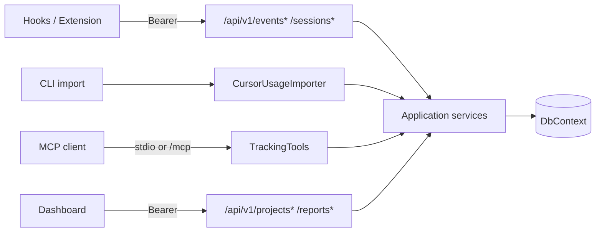

# Architecture

MCP Track Tokens is a local-first stack that records **editor activity**, imports **Cursor usage exports**, and exposes **MCP tools** plus a **dashboard** for project-level time and cost views.

## Components

| Component | Location | Role |
| --- | --- | --- |
| Domain | `src/McpTrackTokens.Domain` | Entities, enums, privacy defaults |
| Application | `src/McpTrackTokens.Application` | Services, DTOs, options, attribution orchestration |
| Infrastructure | `src/McpTrackTokens.Infrastructure` | EF Core, SQLite/PostgreSQL, importers, repositories |
| Server | `src/McpTrackTokens.Server` | HTTP host, `/api/v1`, MCP tools, wwwroot dashboard |
| CLI | `src/McpTrackTokens.Cli` | `mcp-track-tokens` commands; hosts Server via `TrackingHost` |
| Dashboard | `src/McpTrackTokens.Dashboard` | React + Vite UI → copied to Server `wwwroot` |
| Extension | `extensions/mcp-track-tokens-vscode` | Sessions, `@track`, commands |
| Hooks | `integrations/cursor-hooks` | Cursor stdin hooks → `POST /api/v1/events` |

## Runtime defaults

| Item | Value |
| --- | --- |
| Bind / URL | `http://127.0.0.1:5187` |
| Database | `~/.mcp-track-tokens/mcp-track-tokens.db` |
| Exports | `~/.mcp-track-tokens/exports/` |
| Logs | `~/.mcp-track-tokens/logs/` |
| Hook queue | `~/.mcp-track-tokens/queue/` |
| MCP server name | `mcp-track-tokens` `1.0.0` |

Configuration section: `Tracking` in `src/McpTrackTokens.Server/appsettings.json`.  
Environment overrides: `MCP_TRACK_TOKENS_*` via `TrackingEnvironmentVariables`.

## Request paths

## Data model (conceptual)

- **Project** — named tracking target with optional repo path / remote URL / billing metadata.
- **Session** — editor session with heartbeats and inactivity threshold (default 15 minutes).
- **ActivityEvent** — prompt/agent/session events (length/hash; optional encrypted content).
- **ActivityWindow** — derived active-time windows for allocation.
- **ExternalUsage** — normalized rows from Cursor exports.
- **UsageAttribution** — links usage to projects with confidence + strategy.
- **ImportBatch** — file hash, format, dry-run/force semantics.
- **ApiKey** — hashed secrets for Bearer auth.

## Dual dataset model

| Dataset | Produced by | Answers |
| --- | --- | --- |
| Activity | Hooks, extension, MCP session tools | What happened in the editor? |
| Usage | CSV/JSON import | What tokens/cost did Cursor report? |

Attribution **correlates** them; it does not prove a 1:1 mapping to internal Cursor meters.

## Hosting modes

1. **HTTP** (`serve --http`) — API, dashboard static files, optional HTTP MCP when `EnableHttpMcp=true`.
2. **Stdio MCP** (`serve --stdio`) — tool surface for Cursor/VS Code MCP config.
3. **CLI host** — short-lived process for migrate/import/export without long-running HTTP.

Typical desktop setup: one HTTP server for hooks/UI + one stdio MCP process spawned by the editor.

## Layering rules

- Domain has no infrastructure dependencies.
- Application defines interfaces (`IReportService`, `ICursorUsageImporter`, …).
- Infrastructure implements persistence and CSV mapping.
- Server/CLI compose DI via `AddApplication()` + `AddInfrastructure()`.

## Related docs

- [Privacy](privacy.md)
- [Cursor hooks](cursor-hooks.md)
- [Usage imports](usage-imports.md)
- [Cost allocation](cost-allocation.md)
